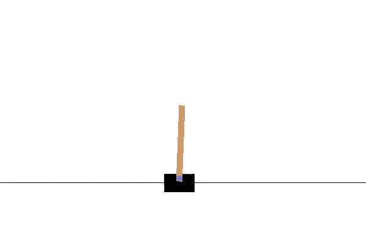

# openai_gym_cartpole_v0

First step into RL with OpenAI gym CartPole-v0

## Getting Started

If you'd like to try your RL algorithm, OpenAI gym is a good place to play around with. Like MNIST for supervised learning, reinforcement learning also demand a benchmark to compare each algorithm. And this is what OpenAI aimed to do. Read more: https://gym.openai.com/.

**CartPole-v0**, one of the simplest item in OpenAI gym. In this game, there is a pole on a cart. And the goal is to balance the pole on the cart and maintain the cart in the range of the window. All you can do is applying a force on the cart from right or left. To learn more about CartPole-v0, check this site: https://gym.openai.com/envs/CartPole-v0.

Here we try simplest Linear model, and use three different algorithms to choose the policy:
* Random guessing
* Hill-climbing
* Policy gradient

### Prerequisites
This code is writing in python. To use it you will need:
* Python 2.7
* [numpy](http://docs.scipy.org/doc/numpy-1.10.0/user/install.html)
* [gym](https://github.com/openai/gym)

## Usage
### Random guessing
choose the policy:
```
python train_random_guess.py
```
This will generate a agent pickle file ./result/random_guess/agent.pkl. To use it:
```
python evaluate_random_guess.py
```
And you'll got some testing result in ./result/experiment-1/. Example:


